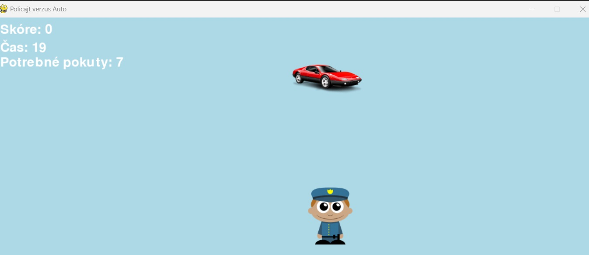
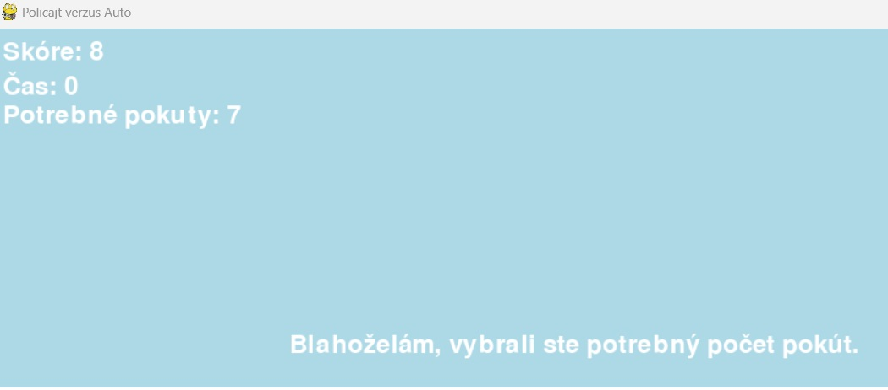
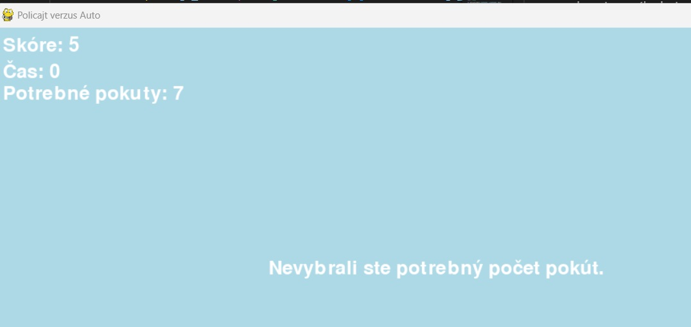

# Hra:  Policajt verzus auto

## Popis hry

Policajt sa pohybuje pomocou smerových šípok do štyroch základných smerov. Auto sa zobrazuje na náhodnej pozícii. V okne hry sú tri ukazovateľe:

    1)  Skóre, ktoré predstavuje počet kolízi policajta a auta. Teda koľko pokút dal policajt.

    2) Čas hry, ktorý sa môže ľubovoľne nastaviť v config.py

    3) Potrebné pokuty, ktoré sú taktiež nastaviteľne.

Cieľom hry je, aby policajt udelil aspoň potrebný počet pokút za čas hry. Musí teda chytiť auto aspoň toľko krát ako je potrebný počet pokút. Pri každom chytení, teda udelení pokuty, auto odfrči na  iné náhodné miesto, pričom sa prehrá zvuk.

Ak to policajt splní tak sa zobrazí správa v hracom okne: 

Ak to policajt nesplní tak sa zobrazí správa v hracom okne: 

## Potrebné vedomosti

    1) modul pygame

    2) modul python - základný kurz

    3) modul random

## Analýza riešenia a naprogramovania hry

Preštudujte si jednotlivé commity od 1 smerom hore. Sú vhodne pomenované, aby sme vedeli čo sme v nich riešili.

